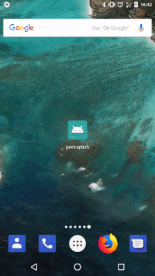

[](https://jitpack.io/#coppernic/AndroidSplashScreen)
[](https://travis-ci.org/CoppernicSoftware/AndroidSplashScreen)


# AndroidSplashScreen
Collection of splash screen for android

## Set up

**build.gradle**

```groovy
repositories {
    maven { url 'https://jitpack.io' }
}

dependencies {
    implementation 'fr.coppernic.coppernic.AndroidSplashScreen:splash:0.3.0'
}
```

This lib is logging with [slf4j](https://www.slf4j.org/)

## Presentation

Right way to perform a splash screen on Android is presented
 [here](https://www.bignerdranch.com/blog/splash-screens-the-right-way/)
 with example on [github](https://github.com/cstew/Splash)

 This lib is adding two features

* Meta data support in Android Manifest to launch a target activity
* Explicit permission request before launching the main activity

### Common part

* Add a layer list with icon to display on start

**res/drawable/background_splash.xml**

```xml
<?xml version="1.0" encoding="utf-8"?>
<layer-list xmlns:android="http://schemas.android.com/apk/res/android">

    <item
        android:drawable="@color/gray"/>

    <item>
        <bitmap
            android:gravity="center"
            android:src="@mipmap/ic_launcher"/>
    </item>

</layer-list>
```

You can use any color defined in **colors.xml**

* Create a theme

**res/values/styles.xml**

```xml
<resources>

    <!-- Base application theme. -->
    <style name="AppTheme" parent="Theme.AppCompat.Light.DarkActionBar">
        <!-- Customize your theme here. -->
        <item name="colorPrimary">@color/colorPrimary</item>
        <item name="colorPrimaryDark">@color/colorPrimaryDark</item>
        <item name="colorAccent">@color/colorAccent</item>
    </style>

    <style name="SplashTheme" parent="Theme.AppCompat.NoActionBar">
        <item name="android:windowBackground">@drawable/background_splash</item>
    </style>

</resources>
```

* Apply the theme to splash activity from lib

**AndroidManifest.xml**

```xml
<activity
    android:name="fr.coppernic.lib.splash.SplashScreen"
    android:theme="@style/SplashTheme">
</activity>
```

### Simple splash

Launch of target activity is done in adding metadata info in manifest

**AndroidManifest.xml**

```xml
<?xml version="1.0" encoding="utf-8"?>

<!-- Here is the package of app -->

<manifest package="fr.coppernic.samples.splash.simple"
          xmlns:android="http://schemas.android.com/apk/res/android">


<!-- All default info goes to "application" -->

    <application
        android:allowBackup="true"
        android:icon="@mipmap/ic_launcher"
        android:label="@string/app_name"
        android:roundIcon="@mipmap/ic_launcher_round"
        android:supportsRtl="true"
        android:theme="@style/AppTheme">

<!-- This is the main activity of our app, it is not launchable directly -->

        <activity android:name=".MainActivity">
        </activity>

<!-- Launchable activity is the splash activity -->

        <activity
            android:name="fr.coppernic.lib.splash.SplashScreen"
            android:theme="@style/SplashTheme">
            <intent-filter>
                <action android:name="android.intent.action.MAIN"/>
                <category android:name="android.intent.category.LAUNCHER"/>
            </intent-filter>

<!-- Metadata to launch the main activity -->

            <meta-data
                android:name="activity"
                android:value="fr.coppernic.samples.splash.simple.MainActivity"/>
        </activity>
    </application>

</manifest>
```

Metadata spec :

* **android:name** : `activity`
* **android:value** : Explicit and full name of target activity (package + class name).
 Example : `fr.coppernic.samples.splash.simple.MainActivity`. Implicit
 classes like `.MainActivity` are **not** supported.

## Timed splash

Whereas it is not recommended, it is possible to add a timing before launching
the target activity. Just add a metadata.

**AndroidManifest.xml**

```xml
<?xml version="1.0" encoding="utf-8"?>

<!-- Here is the package of app -->

<manifest package="fr.coppernic.samples.splash.simple"
          xmlns:android="http://schemas.android.com/apk/res/android">


<!-- All default info goes to "application" -->

    <application
        android:allowBackup="true"
        android:icon="@mipmap/ic_launcher"
        android:label="@string/app_name"
        android:roundIcon="@mipmap/ic_launcher_round"
        android:supportsRtl="true"
        android:theme="@style/AppTheme">

<!-- This is the main activity of our app, it is not launchable directly -->

        <activity android:name=".MainActivity">
        </activity>

<!-- Launchable activity is the splash activity -->

        <activity
            android:name="fr.coppernic.lib.splash.SplashScreen"
            android:theme="@style/SplashTheme">
            <intent-filter>
                <action android:name="android.intent.action.MAIN"/>
                <category android:name="android.intent.category.LAUNCHER"/>
            </intent-filter>

<!-- Metadata to launch the main activity -->

            <meta-data
                android:name="activity"
                android:value="fr.coppernic.samples.splash.simple.MainActivity"/>
            <meta-data
                android:name="timing"
                android:value="2000"/>
        </activity>
    </application>

</manifest>
```

Metadata spec :

* **android:name** : `timing`
* **android:value** : Value of timing in ms

## Permission splash screen



With Android API 26, some permissions are needed to be asked explicitly.

To keep the app simple, PermissionSplashScreen is introduced. It is looking
in manifest to get all `<uses-permission />` nodes and simply makes a request
for all permissions.
t activity. Just add a metadata.

**AndroidManifest.xml**

```xml
<?xml version="1.0" encoding="utf-8"?>
<manifest package="fr.coppernic.samples.splash.permission"
          xmlns:android="http://schemas.android.com/apk/res/android">

    <uses-permission android:name="android.permission.CAMERA"/>
    <uses-permission android:name="android.permission.WRITE_CONTACTS"/>
    <uses-permission android:name="android.permission.WRITE_EXTERNAL_STORAGE"/>

    <application
        android:name=".App"
        android:allowBackup="true"
        android:icon="@mipmap/ic_launcher"
        android:label="@string/app_name"
        android:roundIcon="@mipmap/ic_launcher_round"
        android:supportsRtl="true"
        android:theme="@style/AppTheme">
        <activity android:name=".MainActivity">
        </activity>
        <activity
            android:name="fr.coppernic.lib.splash.PermissionSplashScreen"
            android:theme="@style/SplashTheme">
            <intent-filter>
                <action android:name="android.intent.action.MAIN"/>
                <category android:name="android.intent.category.LAUNCHER"/>
            </intent-filter>
            <meta-data
                android:name="activity"
                android:value="fr.coppernic.samples.splash.permission.MainActivity"/>
        </activity>
    </application>

</manifest>
```

Here, `PermissionSplashScreen` is requesting CAMERA, WRTIE_CONTACTS and
WRITE_EXTERNAL_STORAGE permissions before launching target activity.

